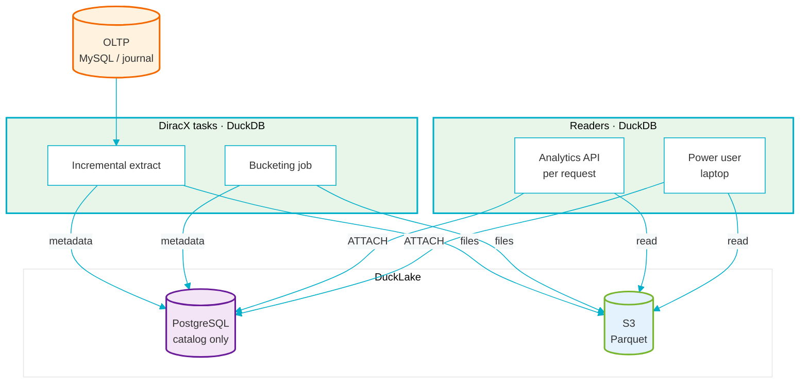
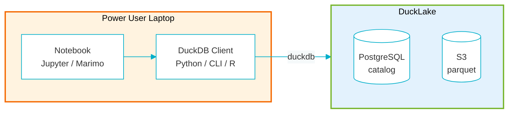
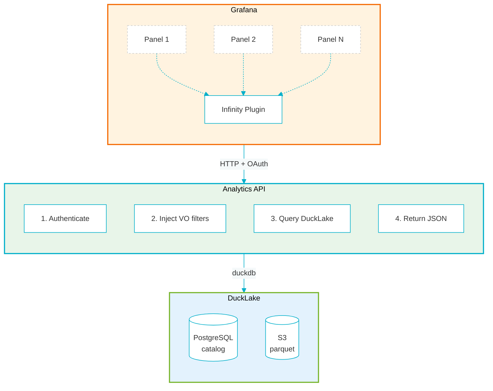

# Analytics in DiracX
## A Comprehensive OLAP Approach

**Dhiraj Kalita** <Email v="dhirajk@post.kek.jp" />

**Federico Stagni** <Email v="federico.stagni@cern.ch" />

<br>

The 12th Dirac(X) Users' workshop -- 13–16 October 2026, FZU Prague

<a href="https://indico.cern.ch/event/1588323/" class="ns-c-iconlink"><mdi-open-in-new />indico.cern.ch/event/1588323</a>

---
layout: section
color: diracx
title: Terms 
---

# Terminology 
---
layout: top-title
color: diracx-light
align: cm
title: terminology-oltp
---

:: title ::

# Terminology: Industry-Standard Terms

:: content ::

**OLTP** – Online Transaction Processing
- The DBs hosting the business logic of what DIRAC(X) does
- Examples: JobDB, PilotAgentsDB, but also the "raw" (`type`) tables of AccountingDB

**OLAP** – Online Analytical Processing
- An **Analytics Platform** is a system designed to collect, store, and analyze large volumes of operational data to support decision-making, reporting, and monitoring.
- What DIRAC calls "Accounting" and "Monitoring" (*This distinction should really go away*)

**ELT** - Extract, Load, Transform
- *Extract* the data (from the OLTP), *Load* it in the OLAP, *Transform* it for consumption later on
- Also **ETL** (Extract, Transform, Load) exists, but likely won't be interesting to us


---
layout: top-title-two-cols
color: diracx-light
align: cm-lm-lm
title: terminology-oltp-2
columns: is-8
---

:: title ::

# Terminology: Industry-Standard Terms/2

:: left ::

**Data Warehouse**
- Structured, curated data organized for querying and reporting
- Schema-on-write; optimized for known analytical workloads

**Data Lake**
- Raw data stored in its native format (files, logs, etc.)
- Schema-on-read; flexible but requires discipline to stay usable

**Data Lakehouse**
- Combines lake flexibility with warehouse structure: governed, query-optimized layers on top of raw storage
- *This is our target architecture*


:: right ::

<SpeechBubble color="sky" shape="round" maxWidth="300px" position="l">
The DIRAC Accounting and Monitoring Systems "resembles" a Data Warehouse
</SpeechBubble>


---
layout: top-title-two-cols
color: diracx-light
align: cm-lm-lm
title: terminology-oltp-3
columns: is-9
---

:: title ::

# Terminology: Industry-Standard Terms/3

:: left ::


**OTEL** – <span class="i-simple-icons:opentelemetry text-lg align-middle inline-block"></span> [OpenTelemetry](https://opentelemetry.io)
- Instrumentation standard for traces, metrics, logs.
  - Also [being added in DiracX](https://github.com/DIRACGrid/diracx/pull/1056)
- This is *not* the main subject of this presentation


<AdmonitionType type='important' >
<strong>OLAP vs OTEL</strong><br>
<br>
<br>
<strong>OLAP</strong> answers <em>"how many jobs ran on site X last month?"</em><br>
(aggregated, historical, business metrics)<br>
<br>
<strong>OTEL</strong> answers <em>"why did this specific request fail right now?"</em><br>
(high-cardinality, real-time, system health)<br>
<br>
They serve different purposes and should not be mixed.
</AdmonitionType>


<AdmonitionType type='note' >
The "telemetry" that has been added <a href="https://dirac.diracgrid.org/en/integration/AdministratorGuide/Systems/MonitoringSystem/index.html#monitoring-of-dirac-agents-and-services" class="slidev-link">in DIRAC</a> won't be ported, and should probably be discontinued already.
</AdmonitionType>


:: right ::


<SpeechBubble color="sky" shape="round" maxWidth="300px" position="l">
Your installation <strong>can</strong> leave without OTEL, not without an OLAP
</SpeechBubble>


---
layout: top-title
color: diracx-light
align: cm
title: scope
---

:: title ::

# Scope

:: content ::

<br>
<br>
<br>
<br>
<br>


<div class="flex flex-col items-center justify-center h-full text-center">

This note proposes a **comprehensive approach for creating an OLAP for DiracX**.

Its purpose is to, at a minimum, **fully replace** the current DIRAC "Accounting" and "Monitoring" systems.

</div>


---
layout: top-title
color: diracx-light
align: cm
title: background
---

:: title ::

# Background

:: content ::


- Initial considerations: [diracx/discussions/199](https://github.com/DIRACGrid/diracx/discussions/199)
- Base for [DIRACx/issues/562](https://github.com/DIRACGrid/DIRACx/issues/562)
- The original plan (heavily relying on OpenSearch) **could not proceed** due to technical limitations

**Related tasks:**
- [Accounting plots for MP jobs](https://github.com/DIRACGrid/diracx/issues/294) – requirements already collected
- [Accounting [Jobs]: don't we need the wallclock time?](https://github.com/DIRACGrid/DIRAC/issues/8277) – simple and clear requirements


---
layout: section
color: diracx
title: User Stories
---

# Requirements


---
layout: top-title
color: diracx-light
align: cm
title: users
---

:: title ::

# Users

:: content ::

- Community users (members of a VO that do not hold specific rights)
- Community operators ("shifters" or whoever is in charge of, e.g., submitting/managing workgraphs)
- Community administrators (VO admins, computing coordinators, etc.)
- Dirac(X) admins (administrators of an installation)


---
layout: top-title
color: diracx-light
align: cm
title: user-stories
---

:: title ::

# User Stories

:: content ::

| **As a...** | **I want to...** | **So that...** |
|---------|-------------|------------|
| Community user | Visualize my own usage through dashboards | |

Users should normally be able to only see their own activities.

<br>

| **As a...** | **I want to...** | **So that...** |
|---------|-------------|------------|
| Community operator | Do real-time community monitoring | I can provide feedback |
| Community operator | Visualize historic data | I can provide community reports |

Operators should be able to see activities of every user inside their VO


---
layout: top-title
color: diracx-light
align: cm
title: user-stories2
---

:: title ::

# User Stories /2

:: content ::

| **As a...** | **I want to...** | **So that...** |
|---------|-------------|------------|
| Community administrator | Explore raw and bucketed data | I can create all visualizations I need |
| Community administrator | Modify the dashboards definitions (consumed e.g. by the operators) | |

Community administrators should be able to access all the recorded information about the VO they administer.

<br>

| **As a...** | **I want to...** | **So that...** |
|---------|-------------|------------|
| DiracX admin | Avoid any new external dependency | |
| DiracX admin | Visualize every community data, and summing them up | I can create plots per-installation |


---
layout: top-title
color: diracx-light
align: cm
title: additional
---

:: title ::

# Additional requirements

:: content :: 

- VOs should be able to **load** community-specific data in the OLAP from a Dirac(X) extension.
- It should be possible to **load** and **read/transform** data to/from the OLAP from outside Dirac(X)
- The OLTP should not be only MySQL.
- The new analytics should have (at a minimum) <strong>all the data</strong> of the existing (legacy) DIRAC accounting.
- Pre-built dashboard definitions should be likely persisted in the code.
- Building blocks should be taken as much as possible off the shelf


---
layout: top-title-two-cols
color: diracx-light
align: cm-lm-lm
title: sources
columns: is-8
---

:: title ::

# Examples of what we want to store in the OLAP

:: left ::

- (for preserving the history) everything that is currently in DIRAC accounting
- everything that keeps being added to the current DIRAC accounting
- (for preserving the history) everything that is currently in DIRAC monitoring
- everything that keeps being added to the current DIRAC monitoring
- analytics data for MP jobs (new)
- TransformationSystem counters
- (LHCb) bookkeeping statistics
- (Belle2) ...?
- ...

:: right ::

<AdmonitionType type='note' >
There might be different ways of <strong>Extraction</strong> (from the OLTP) and <strong>Loading</strong> (into the OLAP). 
</AdmonitionType>

---
layout: section
color: diracx-green
title: Architecture
---

# Architecture and Technology Stack

---
layout: top-title
color: diracx-light
align: cm
title: architecture
---

:: title ::

# High-Level Architecture

:: content ::

- Raw data for analytics is **extracted** from the OLTP sources
  - In most of cases this would be MySQL
  - Other sources can include OpenSearch, but also OpenTelemetry or your system of choice (e.g. an Oracle with data of choice)
- Raw data is loaded into a **columnar DB format**
- Data is stored using a **"lakehouse"** organization
- Visualization using **standard tools**

---
layout: top-title
color: diracx-light
align: cm
title: tech-stack
---

:: title ::

# Suggested Technology Stack

:: content ::

| Technology | Role |
|------------|------|
| <span class="i-simple-icons:apacheparquet text-xl align-middle inline-block"></span> **[Parquet](https://parquet.apache.org)** | Columnar file format; efficient compression and fast analytical queries |
| <span class="i-simple-icons:amazons3 text-xl align-middle inline-block"></span> **[S3](https://aws.amazon.com/s3/)** *(already a DiracX requirement)* | Scalable, durable object storage for parquet files |
| <span class="i-simple-icons:duckdb text-xl align-middle inline-block"></span> **[DuckDB](https://duckdb.org)** | In-process analytics engine; also handles data bucketing |
| **[DuckLake](https://ducklake.select)** | Lakehouse layer: organizes parquet files with a <span class="i-logos:postgresql text-lg align-middle inline-block"></span> PostgreSQL catalog |
| <span class="i-logos:grafana text-xl align-middle inline-block"></span> **[Grafana](https://grafana.com)** | Dashboards & visualizations via Infinity plugin |

<br>

<AdmonitionType type='important' >
There are alternatives for each of these building blocks
</AdmonitionType>

---
layout: section
color: diracx-green
title: ETL 
---

# Extracting the data (the E in ELT)


---
layout: top-title
color: diracx-light
align: cm
title: data-ingestion
---

:: title ::

# Extracting Data from OLTP → OLAP

:: content ::

We can always load "old" accounting data by **dump-and-restore**. The real question is **(near) real-time monitoring**.

**4 main approaches considered:**

1. **CDC (Change Data Capture)** – e.g., `pymysqlreplication` on <span class="i-logos:mysql text-lg align-middle inline-block"></span> MySQL binlog → *considered a burden*
2. **Replication stream technologies** – e.g., [sling CLI](https://github.com/slingdata-io/sling-cli) with MySQL + DuckLake connectors
3. <span class="i-logos:mysql text-lg align-middle inline-block"></span> **MySQL triggers** (counters) polled by DiracX tasks
4. **Incremental queries** (every 1-2 min) → `SELECT * WHERE LastUpdateTime > ?`

Approach #4 (incremental queries) looks like the most generically suitable option

---
layout: top-title
color: diracx-light
align: cm
title: dx-adr-009
---

:: title ::

# Connection to DX-ADR-009: Journalled Counters

:: content ::

DiracX already defines a journalled counter mechanism in **DX-ADR-009**

- Writers append **signed deltas** to a journal table in the same transaction as the change
- A periodic aggregator **folds** deltas into counter tables
- **Exact reads** at any aggregation lag

**This journal is a ready-made CDC source for the OLAP:**

- Query the journal table incrementally (`WHERE JournalID > ?`)
- Deltas are already structured and signed
- No external dependencies, no binlog parsing, no triggers

<AdmonitionType type='note' >
DX-ADR-009 counters (e.g., TransformationCounters, DataParcelsCounters) provide pre-aggregated data that can feed directly into analytics dashboards.
</AdmonitionType>


---
layout: section
color: diracx-green
title: ELT-L 
---

# Loading the data (the L in ELT)


---
layout: top-title
color: diracx-light
align: cm
title: ducklake
---

:: title ::

<center></center>


:: content ::

- **SQL as lakehouse format** – metadata stored in a SQL catalog (PostgreSQL). No custom catalog server required
- **ACID transactions** – concurrent access with full transactional guarantees over multi-table operations
- **Snapshots & time travel** – query data as of any point in time, without expensive compaction steps
- **Schema evolution & partitioning** – adapt tables over time without breaking existing queries
- **Open Parquet storage** – data lives in plain Parquet files on disk or object storage, compatible with Iceberg
- **Fast queries** – filter pushdown via column statistics, even on large datasets

<AdmonitionType type='important' >
DuckLake enables a <strong>"multiplayer DuckDB"</strong> experience – multiple instances can read and write the same dataset concurrently, a concurrency model <em>not</em> supported by vanilla DuckDB.
</AdmonitionType>


---
layout: top-title-two-cols
color: diracx-light
align: cm-lm-lm
title: ducklake-deployment
columns: is-5
---

:: title ::

# DuckLake Deployment

:: left ::

Three pieces — only two are deployed services.

- **PostgreSQL** — catalog only (schemas, snapshots, file lists); **no analytical rows**. [DuckLake's recommended choice](https://ducklake.select/docs/stable/duckdb/usage/choosing_a_catalog_database); MySQL has connector issues, SQLite is single-writer.
- **S3** — the data: raw + bucketed Parquet. Already a DiracX requirement.
- **DuckDB** — not a server: each writer/reader `ATTACH`es the catalog.

<AdmonitionType type='note' >
Filesystem instead of S3 works, but is not advised.
</AdmonitionType>

:: right ::

<div class="mermaid" style="transform: scale(0.92); transform-origin: top center; margin-bottom: 1rem;">



</div>


---
layout: section
color: diracx-green
title: ELT-T
---

# Transforming the data (the T in ELT)

---
layout: top-title
color: diracx-light
align: cm
title: bucketing-strategy
---

:: title ::

# Data Bucketing Strategy

:: content ::

Raw records are stored in **Parquet** (the source of truth); time-bucketed, pre-aggregated tables are **derived** by DuckDB inside DuckLake.

| Concern | Approach |
|---------|----------|
| **Granularity** | Configurable bins (e.g. hour / day / week / month) |
| **Producers** | Periodic **DiracX task** running a DuckDB job in DuckLake |
| **Freshness** | Recent data served raw for near real-time; older data from buckets, with on-demand fallback to raw |
| **Retention** | Raw persisted forever (cold storage); buckets as accelerator |
| **Compatibility** | Mirrors DIRAC Accounting's existing bucketing model |

<AdmonitionType type='note' >
Bucket sizes are <strong>open questions</strong> — feedback welcome.
</AdmonitionType>

---
layout: top-title
color: diracx-light
align: cm
title: retention-policy
---

:: title ::

# Data Retention Policy

:: content ::

Raw is the source of truth and is **persisted forever**; bucketed tables are pre-aggregated **accelerators** kept for query speed.

| Level | Rows | Retention |
|-------|------|-----------|
| **Raw** (per record) | largest | **forever** |
| **Hourly** | 24×/day | 6–12 months |
| **Daily** | 1×/day | 3–5 years |
| **Monthly** | 1×/month | 3–5 years |

<AdmonitionType type='important' >
Missing bucket coverage falls back to <strong>on-demand aggregation over raw</strong> — any granularity, any period, always answerable.
</AdmonitionType>

<AdmonitionType type='note' >
Since raw is kept forever, every bucket level is a <strong>prunable cache</strong>; windows are <strong>open questions</strong> — feedback welcome.
</AdmonitionType>


---
layout: section
color: diracx-green
title: visualizations 
---

# Visualizing what is in the ducklake


---
layout: top-title-two-cols
color: diracx-light
align: cm-lm-lm
title: visualization-arch-power
columns: is-5
---

:: title ::

# Visualization Architecture for power users

:: left ::

Power users can **query DuckLake directly** – raw or bucketed data, no API in between.

- **Direct DuckDB access** – install `duckdb` and `ATTACH` the DuckLake
- **Any visualization tool** – Matplotlib, Plotly, Altair, DuckDB CLI, or whatever you prefer
- **Notebooks** – [Jupyter](https://jupyter.org) or [Marimo](https://marimo.io) for interactive exploration
- **Raw + bucketed data** – query any granularity, run ad-hoc aggregations

:: right ::

<div class="mermaid" style="transform: scale(1.05); transform-origin: top center; margin-bottom: 1rem;">



</div>

<AdmonitionType type='note' >
No Friction: power users don't need DiracX running at all – just DuckDB + network access to the catalog and S3.
</AdmonitionType>

---
layout: top-title-two-cols
color: diracx-light
align: cm-lm-lm
title: visualization-arch-users
columns: is-5
---

:: title ::

# <span class="i-logos:grafana text-3xl align-middle inline-block"></span> Visualization Architecture for generic users

:: left ::

Generic users interact with **pre-built Grafana dashboards** – no direct database access needed.

- **Grafana + Infinity plugin** – connects to a DiracX analytics endpoint
- **OAuth passthrough** – user tokens are forwarded, VO/tenant filters applied server-side
- **Zero dependencies** – users only need a browser


<AdmonitionType type='note' >
Users see only their own data – VO and tenant scoping is enforced by the DiracX API, not by the dashboard configuration.
</AdmonitionType>

:: right ::

<div class="mermaid" style="transform: scale(0.9); transform-origin: top center; margin-bottom: 1rem;">



</div>

---
layout: top-title
color: diracx-light
align: cm
title: backend-decision
---

:: title ::

# Key Decision: Backend

:: content ::

**duckdb-python + FastAPI**

One DuckDB process per request. No persistent DuckDB server needed. Queries DuckLake directly:

```python
import duckdb
from fastapi import FastAPI

app = FastAPI()

@app.get("/api/analytics/query")
async def analytics_query():
    # Query DuckLake directly
    # Return as Arrow IPC stream or JSON
    return {"columns": list(table.column_names), "data": table.to_pydict()}
```

<AdmonitionType type='note' >
Authentication and tenant/VO filter injection are handled by existing DiracX middleware.
</AdmonitionType>

---
layout: top-title
color: diracx-light
align: cm
title: frontend-decision
---

:: title ::

# Key Decision: Frontend

:: content ::

**<span class="i-logos:grafana text-xl align-middle inline-block"></span> Grafana + Infinity data source plugin**

Given that we expose a REST API via FastAPI, the [Infinity data source plugin](https://grafana.com/docs/plugins/yesoreyeram-infinity-datasource) is a strong candidate:

| Component | Responsibility |
| --- | --- |
| **FastAPI Backend** | Validates user tokens, applies row-level/tenant security, queries DuckLake, returns JSON arrays |
| <span class="i-logos:grafana text-lg align-middle inline-block"></span> **Grafana Infinity** | HTTP client inside Grafana; connects to FastAPI with secure, forwarded OAuth headers |
| <span class="i-logos:grafana text-lg align-middle inline-block"></span> **Grafana Panels** | Uses UQL or JSONata within Infinity to transform JSON into tables, time series, or charts |

<AdmonitionType type='note' >
Infinity connects to any HTTP/JSON endpoint, making it a natural fit for our FastAPI analytics route.
</AdmonitionType>

---
layout: top-title
color: diracx-light
align: cm
title: security
---

:: title ::

# Security

:: content ::

To **query the lakehouse directly**, direct access is needed – this is for **power users only**.


<br>

For everyone else:
- **Short-lived credentials** provided by the FastAPI analytics endpoint
- Authentication via existing DiracX auth
- Tenant/VO filters automatically injected

<AdmonitionType type='important' >
Power users need DuckDB installed and can query directly. Standard users go through the API.
</AdmonitionType>

---
layout: top-title
color: diracx-light
align: cm
title: compute-location
---

:: title ::

# Where the Computing Happens

:: content ::

DuckLake divides into 3 components:
- **Storage** (S3, parquet files)
- **Catalog** (PostgreSQL)
- **Compute** (where SELECTs and compactions happen)

| User Type | Where Compute Happens |
|-----------|----------------------|
| **Power users** (direct lakehouse access) | On their laptops (DuckDB required) |
| **Dashboard users** (Dirac-steered) | On the server |

<AdmonitionType type='note' >
Storage and catalog can be "outside of Dirac" – selected users should be able to read without going through Dirac.
</AdmonitionType>

---
layout: section
color: diracx-green
title: Changes
---

# Changes WRT DIRAC

---
layout: top-title
color: diracx-light
align: cm
title: changes-wrt-dirac
---

:: title ::

# Changes WRT DIRAC

:: content ::

In pure technology stack terms, DiracX OLAP would **share nothing** with the existing Accounting System.

| **DIRAC Accounting** | **DiracX OLAP** |
|------------------|-------------|
| <span class="i-logos:mysql text-lg align-middle inline-block"></span> MySQL, <span class="i-logos:opensearch text-lg align-middle inline-block"></span> OpenSearch | Columnar (Parquet + DuckLake) |
| Custom, hardly maintainable | Standard tools & formats |
| Data **pushed** by `DataStore` clients | Data **pulled** (extracted) from OLTP |
| Scalability not at today's level | Designed for current scale |

<AdmonitionType type='important' >
The system moves from <strong>push-based</strong> to <strong>pull-based</strong> data ingestion.
</AdmonitionType>

---
layout: top-title
color: diracx-light
align: cm
title: migration
---

:: title ::

# Deployment & Migration

:: content ::

- **Old accounting data** (MySQL) – raw "type" tables still exist, can be ingested into the new system
- **Old monitoring data** (OpenSearch) – similarly ingestable (raw data need not go back to the beginning of time)
- **Dump-and-restore** for historical data
- **Incremental queries** for near real-time ingestion
- the legacy DIRAC systems and the new Analytics platform can (should) co-exist

---
layout: section
color: diracx-green
title: Conclusions
---

# To conclude


---
layout: top-title
color: diracx-light
align: cm
title: rejected
---

:: title ::

# Rejected ideas

:: content ::

- Develop **our own solution**: the market has plenty of solutions from which to choose from 
- Keep trying with an **OpenSearch-based approach**: we opened issues but got no reactions
- Use **ClickHouse** (an open-source column oriented DBMS) as it'd be a new service
- ELT **extraction with a log-based CDC** (*Change Data Capture*)
  - Linked to the OLTP solution (MySQL `binlog`, Oracle `redo log`, etc.)
  - perceived as an added complication
  - we do not need milli-second precision
- Use [Grafana-duckDB plugin](https://github.com/motherduckdb/grafana-duckdb-datasource)
  - not officially supported by Grafana
  - requires specific images
  - scalability concerns


---
layout: top-title-two-cols
color: diracx-light
align: cm-cm-lm
columns: is-3
title: summary
---

:: title ::

# Summary

:: left ::

<div class="flex justify-center items-center gap-4">
   </img>
  <span class="i-simple-icons:duckdb text-5xl"></span>
</div>

:: right ::

- We are proposing a solution for a **Full replacement** of DIRAC Accounting & Monitoring systems
- **Standard stack**: Parquet + S3 + DuckLake + DuckDB.
- **Pull-based** ingestion from OLTP via incremental queries
- **Two access modes**: direct (power users) and API-mediated (everyone else)
- **Zero new external dependencies** for core DiracX


---
layout: top-title
color: diracx-light
align: cm
title: next
---

:: title ::

# What's next

:: content ::

In this workshop:
- Come and discuss this afternoon after the coffee break
- We can also show you a PoC

Later on:
- write down an ADR, and start implementation when approved


---
layout: credits
color: diracx
loop: true
speed: 1.4
title: credits/people
---

<div class="grid text-size-4 grid-cols-3 w-3/4 gap-y-10 auto-rows-min ml-auto mr-auto">
    <div class="grid-item text-center mr-0- col-span-3">
        <strong>Authors</strong><br>
    </div>
    <div class="grid-item col-span-3">
        Federico Stagni <i>CERN, LHCb</i><br/>
        Dhiraj Kalita <i>KEK (JP), Belle2</i>
    </div>
    <div class="grid-item text-center mr-0- col-span-3">
        <strong>Contributors</strong><br>
    </div>
    <div class="grid-item col-span-3">
        Todor Ivanov <i>Notre Dame University (US), CMS</i><br/>
        Henryk Giemza <i>NCBJ (PL), LHCb</i><br/>
        Christophe Haen <i>CERN, LHCb</i><br/>
        Alexandre Boyer <i>CERN, LHCb</i><br/>
    </div>
</div>

&nbsp;
&nbsp;
&nbsp;
