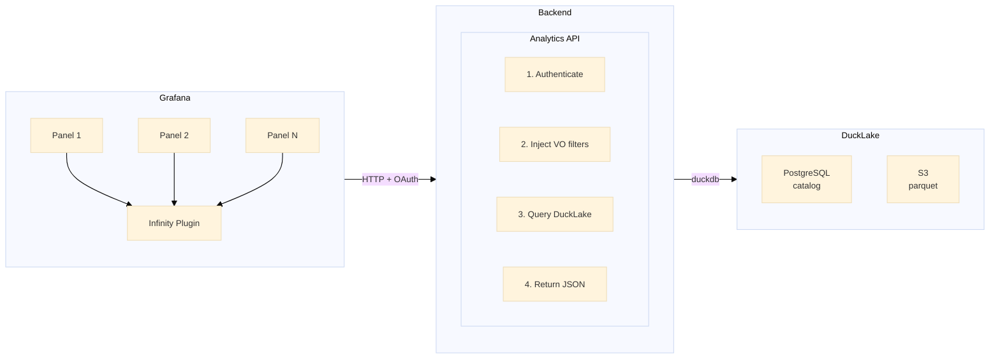

# Analytics in DiracX
## A Comprehensive OLAP Approach

**Dhiraj Kalita** <Email v="dhirajk@post.kek.jp" />

**Federico Stagni** <Email v="federico.stagni@cern.ch" />

<br>

13–16 October 2026, FZU Prague

<a href="https://indico.cern.ch/event/1588323/" class="ns-c-iconlink"><mdi-open-in-new />indico.cern.ch/event/1588323</a>

---
layout: top-title
color: diracx-light
align: cm
title: terminology-oltp
---

:: title ::

# Terminology: Industry-Standard Terms

:: content ::

**OLTP** – Online Transaction Processing
- The DBs hosting the business logic of what DIRAC(X) does
- Examples: JobDB, PilotAgentsDB, but also the "raw" (`type`) tables of AccountingDB

**OLAP** – Online Analytical Processing
- An **Analytics Platform** is a system designed to collect, store, and analyze large volumes of operational data to support decision-making, reporting, and monitoring.
- What DIRAC calls "Accounting" (bucketed tables) and "Monitoring" (*This distinction should really go away*)

**ELT** - Extract, Load, Transform
- Extract the data (e.g. from OLTP), Load it in the OLAP. Transform it for consumption later on
- Also **ETL** (Extract, Transform, Load) exists, but likely won't be interesting to us


---
layout: top-title
color: diracx-light
align: cm
title: terminology-oltp-2
---

:: title ::

# Terminology: Industry-Standard Terms/2

:: content ::

**Data Warehouse**
- Structured, curated data organized for querying and reporting
- Schema-on-write; optimized for known analytical workloads

**Data Lake**
- Raw data stored in its native format (files, logs, etc.)
- Schema-on-read; flexible but requires discipline to stay usable

**Data Lakehouse**
- Combines lake flexibility with warehouse structure: governed, query-optimized layers on top of raw storage
- *This is our target architecture*


---
layout: top-title
color: diracx-light
align: cm
title: terminology-oltp-3
---

:: title ::

# Terminology: Industry-Standard Terms/3

:: content ::

**OTEL** – [OpenTelemetry](https://opentelemetry.io)
- Instrumentation standard for traces, metrics, logs. Also being added in DiracX.
- What has been added [in DIRAC](https://dirac.diracgrid.org/en/integration/AdministratorGuide/Systems/MonitoringSystem/index.html#monitoring-of-dirac-agents-and-services) won't be ported, and should probably be discontinued already
- This is *not* the main subject of this presentation

<br>

<AdmonitionType type='important' >
<strong>OLAP vs OTEL</strong><br>
<br>
<br>
<strong>OLAP</strong> answers <em>"how many jobs ran on site X last month?"</em><br>
(aggregated, historical, business metrics)<br>
<br>
<strong>OTEL</strong> answers <em>"why did this specific request fail right now?"</em><br>
(high-cardinality, real-time, system health)<br>
<br>
They serve different purposes and should not be mixed.
</AdmonitionType>

---
layout: top-title
color: diracx-light
align: cm
title: scope
---

:: title ::

# Scope

:: content ::

This note proposes a **comprehensive approach for creating an OLAP for DiracX**.

Its purpose is to **fully replace** the current DIRAC "Accounting" and "Monitoring" systems.

<br>
<br>
<br>
<br>
<br>

<AdmonitionType type='note' >
The new analytics should have (at a minimum) <strong>all the data</strong> of the existing (legacy) DIRAC accounting.
</AdmonitionType>

---
layout: top-title
color: diracx-light
align: cm
title: background
---

:: title ::

# Background

:: content ::

- Initial considerations: [diracx/discussions/199](https://github.com/DIRACGrid/diracx/discussions/199)
- Base for [DIRACx/issues/562](https://github.com/DIRACGrid/DIRACx/issues/562)
- The original plan (heavily relying on OpenSearch) **cannot proceed** due to technical limitations

**Related tasks:**
- [Accounting plots for MP jobs](https://github.com/DIRACGrid/diracx/issues/294) – requirements already collected
- [Accounting [Jobs]: don't we need the wallclock time?](https://github.com/DIRACGrid/DIRAC/issues/8277) – simple and clear requirements

---
layout: section
color: diracx
title: User Stories
---

# User Stories


---
layout: top-title
color: diracx-light
align: cm
title: user-stories
---

:: title ::

# User Stories

:: content ::

expand...:


---
layout: top-title
color: diracx-light
align: cm
title: user-stories
---

:: title ::

# User Stories

:: content ::

| As a... | I want to... | So that... |
|---------|-------------|------------|
| Community administrator | Create plots outside pre-defined dashboards | – |
| Community administrator | Explore raw and bucketed data | I can create new visualizations |
| DiracX admin | Avoid any new external dependency | – |
| DiracX operator | Do real-time monitoring | – |
| DiracX operator | Visualize historic data | – |

<AdmonitionType type='note' >
<strong>Contribution requested:</strong> These are a few basic, not-too-obvious user stories. More are welcome!
</AdmonitionType>

---
layout: section
color: diracx-green
title: Architecture
---

# Architecture and Technology Stack

---
layout: top-title
color: diracx-light
align: cm
title: architecture
---

:: title ::

# High-Level Architecture

:: content ::

- Raw data for analytics is **extracted** from the OLTP sources
  - In vast majority of the cases this would be MySQL
  - Other sources can include OpenSearch, but also OpenTelemetry or your system of choice (e.g. an Oracle with data of choice)
- Raw data is loaded into a **columnar DB format**
- Data is stored using a **"lakehouse"** organization
- Visualization using **standard tools**

---
layout: top-title
color: diracx-light
align: cm
title: tech-stack
---

:: title ::

# Suggested Technology Stack

:: content ::

| Technology | Role |
|------------|------|
| **[Parquet](https://parquet.apache.org)** | Columnar file format; efficient compression and fast analytical queries |
| **[S3](https://aws.amazon.com/s3/)** *(already a DiracX requirement)* | Scalable, durable object storage for parquet files |
| **[DuckDB](https://duckdb.org)** | In-process analytics engine; also handles data bucketing |
| **[DuckLake](https://ducklake.select)** | Lakehouse layer: organizes parquet files with a PostgreSQL catalog |

---
layout: top-title
color: diracx-light
align: cm
title: data-ingestion
---

:: title ::

# Extracting Data from OLTP → OLAP

:: content ::

We can always load "old" accounting data by **dump-and-restore**. The real question is **(near) real-time monitoring**.

**4 main approaches considered:**

1. **CDC (Change Data Capture)** – e.g., `pymysqlreplication` on MySQL binlog → *considered a burden*
2. **Replication stream technologies** – e.g., [sling CLI](https://github.com/slingdata-io/sling-cli) with MySQL + DuckLake connectors
3. **MySQL triggers** (counters) polled by DiracX tasks
4. **Incremental queries** (every 1-2 min) → `SELECT * WHERE LastUpdateTime > ?`

<AdmonitionType type='important' >
<strong>19th June 2026:</strong> Approach #4 (incremental queries) looks like the most generically suitable option
</AdmonitionType>

---
layout: top-title
color: diracx-light
align: cm
title: dx-adr-009
---

:: title ::

# Connection to DX-ADR-009: Journalled Counters

:: content ::

DiracX already defines a journalled counter mechanism in **DX-ADR-009**

- Writers append **signed deltas** to a journal table in the same transaction as the change
- A periodic aggregator **folds** deltas into counter tables
- **Exact reads** at any aggregation lag

**This journal is a ready-made CDC source for the OLAP:**

- Query the journal table incrementally (`WHERE JournalID > ?`)
- Deltas are already structured and signed
- No external dependencies, no binlog parsing, no triggers

<AdmonitionType type='note' >
DX-ADR-009 counters (e.g., TransformationCounters, DataParcelsCounters) provide pre-aggregated data that can feed directly into analytics dashboards.
</AdmonitionType>

---
layout: top-title
color: diracx-light
align: cm
title: bucketing-strategy
---

:: title ::

# Data Bucketing Strategy

:: content ::

Raw records are landed as **Parquet** (the source of truth); time-bucketed, pre-aggregated tables are **derived** by DuckDB inside DuckLake.

| Concern | Approach |
|---------|----------|
| **Granularity** | Configurable bins (e.g. hour / day / week / month) |
| **Producers** | Periodic **DiracX task** running a DuckDB job in DuckLake |
| **Freshness** | Recent data served raw for near real-time; older data from buckets, with on-demand fallback to raw |
| **Retention** | Raw persisted forever (cold storage); buckets as accelerator |
| **Compatibility** | Mirrors DIRAC Accounting's existing bucketing model |

<AdmonitionType type='note' >
Bucket sizes are <strong>open questions</strong> — feedback welcome.
</AdmonitionType>

---
layout: top-title
color: diracx-light
align: cm
title: retention-policy
---

:: title ::

# Data Retention Policy

:: content ::

Raw is the source of truth and is **persisted forever**; bucketed tables are pre-aggregated **accelerators** kept for query speed.

| Level | Rows | Retention |
|-------|------|-----------|
| **Raw** (per record) | largest | **forever** |
| **Hourly** | 24×/day | 6–12 months |
| **Daily** | 1×/day | 3–5 years |
| **Monthly** | 1×/month | 3–5 years |

<AdmonitionType type='important' >
Missing bucket coverage falls back to <strong>on-demand aggregation over raw</strong> — any granularity, any period, always answerable.
</AdmonitionType>

<AdmonitionType type='note' >
Since raw is kept forever, every bucket level is a <strong>prunable cache</strong>; windows are <strong>open questions</strong> — feedback welcome.
</AdmonitionType>

---
layout: top-title
color: diracx-light
align: cm
title: visualization-arch
---

:: title ::

# Visualization Architecture

:: content ::

<br>


<div class="mermaid" style="transform: scale(1.05); transform-origin: top left; margin-bottom: 1.5rem;">



</div>

---
layout: top-title
color: diracx-light
align: cm
title: backend-decision
---

:: title ::

# Key Decision: Backend

:: content ::

**duckdb-python + FastAPI**

One DuckDB process per request. No persistent DuckDB server needed. Queries DuckLake directly:

```python
import duckdb
from fastapi import FastAPI

app = FastAPI()

@app.get("/api/analytics/query")
async def analytics_query():
    # Query DuckLake directly
    # Return as Arrow IPC stream or JSON
    return {"columns": list(table.column_names), "data": table.to_pydict()}
```

<AdmonitionType type='note' >
Authentication and tenant/VO filter injection are handled by existing DiracX middleware.
</AdmonitionType>

---
layout: top-title
color: diracx-light
align: cm
title: frontend-decision
---

:: title ::

# Key Decision: Frontend

:: content ::

**Grafana + Infinity data source plugin**

Given that we expose a REST API via FastAPI, the [Infinity data source plugin](https://grafana.com/docs/plugins/yesoreyeram-infinity-datasource) is a strong candidate:

| Component | Responsibility |
| --- | --- |
| **FastAPI Backend** | Validates user tokens, applies row-level/tenant security, queries DuckLake, returns JSON arrays |
| **Grafana Infinity** | HTTP client inside Grafana; connects to FastAPI with secure, forwarded OAuth headers |
| **Grafana Panels** | Uses UQL or JSONata within Infinity to transform JSON into tables, time series, or charts |

<AdmonitionType type='note' >
Infinity connects to any HTTP/JSON endpoint, making it a natural fit for our FastAPI analytics route.
</AdmonitionType>

---
layout: top-title
color: diracx-light
align: cm
title: security
---

:: title ::

# Security

:: content ::

To **query the lakehouse directly**, direct access is needed – this is for **power users only**.

For everyone else:
- **Short-lived credentials** provided by the FastAPI analytics endpoint
- Authentication via existing DiracX auth
- Tenant/VO filters automatically injected

<AdmonitionType type='important' >
Power users need DuckDB installed and can query directly. Standard users go through the API.
</AdmonitionType>

---
layout: top-title
color: diracx-light
align: cm
title: compute-location
---

:: title ::

# Where the Computing Happens

:: content ::

DuckLake divides into 3 components:
- **Storage** (S3, parquet files)
- **Catalog** (PostgreSQL)
- **Compute** (where SELECTs and compactions happen)

| User Type | Where Compute Happens |
|-----------|----------------------|
| **Power users** (direct lakehouse access) | On their laptops (DuckDB required) |
| **Dashboard users** (Dirac-steered) | On the server |

<AdmonitionType type='note' >
Storage and catalog can be "outside of Dirac" – selected users should be able to read without going through Dirac.
</AdmonitionType>

---
layout: section
color: diracx-green
title: Changes
---

# Changes WRT DIRAC

---
layout: top-title
color: diracx-light
align: cm
title: changes-wrt-dirac
---

:: title ::

# Changes WRT DIRAC

:: content ::

In pure technology stack terms, DiracX OLAP would **share nothing** with the existing Accounting System.

| **DIRAC Accounting** | **DiracX OLAP** |
|------------------|-------------|
| MySQL, OpenSearch | Columnar (Parquet + DuckLake) |
| Custom, hardly maintainable | Standard tools & formats |
| Data **pushed** by `DataStore` clients | Data **pulled** (extracted) from OLTP |
| Scalability not at today's level | Designed for current scale |

<AdmonitionType type='important' >
The system moves from <strong>push-based</strong> to <strong>pull-based</strong> data ingestion.
</AdmonitionType>

---
layout: top-title
color: diracx-light
align: cm
title: migration
---

:: title ::

# Deployment & Migration

:: content ::

- **Old accounting data** (MySQL) – raw "type" tables still exist, can be ingested into the new system
- **Old monitoring data** (OpenSearch) – similarly ingestable (raw data need not go back to the beginning of time)
- **Dump-and-restore** for historical data
- **Incremental queries** for near real-time ingestion

---
layout: top-title
color: diracx-light
align: cm
title: qa
---

:: title ::

# Q&A

:: content ::

**Why DuckDB?**
- Mature software, **zero dependencies**

**Do I really need S3?**
- Technically no (data can stay on disk), but **not advised**

**What about current accounting data?**
- Raw "type" tables have never been removed – can be ingested

**What about current monitoring data?**
- Similarly ingestable (raw data shouldn't go back to beginning of time)

---
layout: section
color: diracx-green
title: Conclusions
---

# Summary

---
layout: top-title-two-cols
color: diracx-light
align: cm-cm-lm
columns: is-3
title: summary
---

:: title ::

# Summary

:: left ::

 </img>

:: right ::

- **Full replacement** of DIRAC Accounting & Monitoring
- **Standard stack**: Parquet + S3 + DuckLake + DuckDB
- **Pull-based** ingestion from OLTP via incremental queries
- **Two access modes**: direct (power users) and API-mediated (everyone else)
- **Zero new external dependencies** for core DiracX
- **Migration path** for existing data is straightforward

---
layout: credits
color: diracx
loop: true
speed: 1.4
title: credits/people
---

<div class="grid text-size-4 grid-cols-3 w-3/4 gap-y-10 auto-rows-min ml-auto mr-auto">
    <div class="grid-item text-center mr-0- col-span-3">
        <strong>Authors</strong><br>
    </div>
    <div class="grid-item col-span-3">
        Federico Stagni <i>CERN, LHCb</i><br/>
        Dhiraj Kalita <i>KEK (JP), Belle2</i>
    </div>
    <div class="grid-item text-center mr-0- col-span-3">
        <strong>Contributors</strong><br>
    </div>
    <div class="grid-item col-span-3">
        Todor Ivanov <i>Notre Dame University (US), CMS</i><br/>
        Henryk Giemza <i>NCBJ (PL), LHCb</i><br/>
        Christophe Haen <i>CERN, LHCb</i><br/>
        Alexandre Boyer <i>CERN, LHCb</i><br/>
    </div>
</div>

&nbsp;
&nbsp;
&nbsp;
